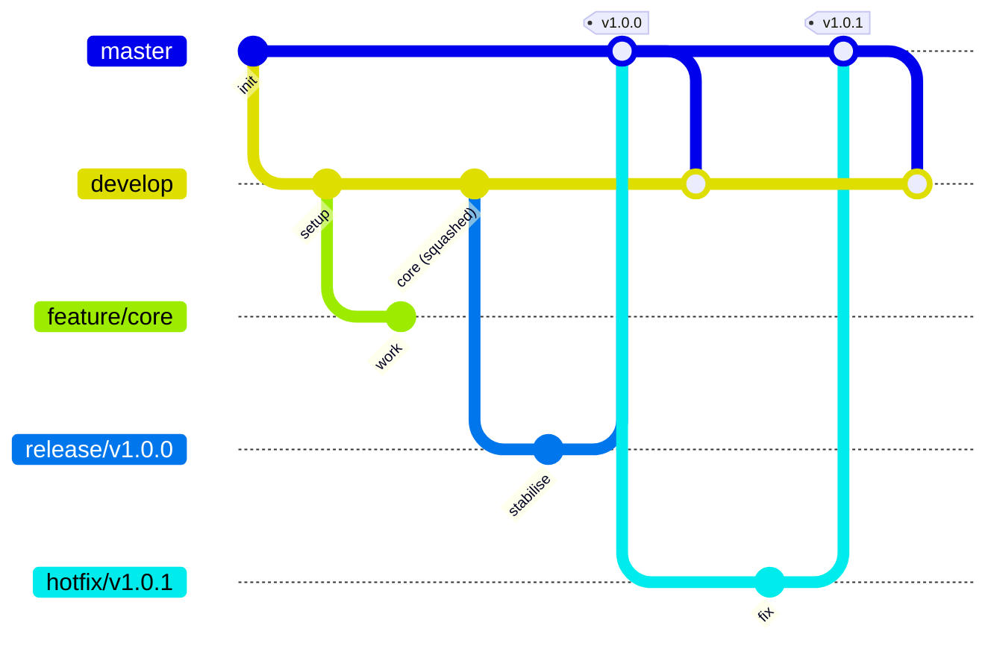

# CONTRIBUTING

This document provides all the information you would need to contribute to this repository.
If you have any questions, please feel free to contact the repository owner. Details provided in the footer.

---

## TABLE OF CONTENTS

- [CONTRIBUTING](#contributing)
  - [TABLE OF CONTENTS](#table-of-contents)
  - [Branching Workflow](#branching-workflow)
    - [Permanent branches](#permanent-branches)
    - [Supporting branches](#supporting-branches)
    - [Naming conventions](#naming-conventions)
    - [Workflow](#workflow)
      - [Starting a feature](#starting-a-feature)
      - [Starting a release](#starting-a-release)
      - [Starting a hotfix](#starting-a-hotfix)
    - [Pull requests](#pull-requests)
    - [Closing issues](#closing-issues)
  - [Commit message requirements](#commit-message-requirements)
  - [Continuous integration checks](#continuous-integration-checks)
  - [Code comment style](#code-comment-style)
  - [CONTACT INFORMATION](#contact-information)
  - [COPYRIGHT](#copyright)

---

## Branching Workflow

This repository follows a Gitflow-style workflow, with one deliberate
deviation from strict Gitflow: **feature branches are squash-merged into
`develop`**, rather than merged with a merge commit. Release and hotfix
branches still merge normally (a real merge commit), so `master`'s history
and version tags stay intact.

It defines two permanent branches and several types of short-lived
supporting branches, each with a specific purpose and merge direction.

---

### Permanent branches

| Branch    | Purpose                                                                                       |
|-----------|-----------------------------------------------------------------------------------------------|
| `master`  | Production-ready code only. Every commit on `master` is a release.                            |
| `develop` | Integration branch. Reflects the latest delivered development changes for the next release.   |

Nobody commits directly to `master` or `develop`. All changes arrive via
pull requests from supporting branches.

---

### Supporting branches

| Branch | From      | Merges into           | Merge type    | Naming             | Purpose                         |
|--------|-----------|-----------------------|---------------|--------------------|---------------------------------|
| Feature| `develop` | `develop`             | Squash merge  | `feature/<name>`   | New or in-progress functionality|
| Release| `develop` | `master`              | Merge commit  | `release/<version>`| Stabilise and prepare a release |
| Hotfix | `master`  | `master`              | Merge commit  | `hotfix/<version>` | Urgent production fixes         |

Squashing a feature branch collapses all of its commits into a single new
commit on `develop`. That commit has no merge-parent link back to
`feature/<name>`, so the branch's individual commits do not appear in
`develop`'s history — only the squashed result does.

**Neither `release/*` nor `hotfix/*` ever merges into `develop` directly.**
Both only ever merge *out* to `master` via pull request. `develop` picks up
everything that lands on `master` — a release, a hotfix, or semantic-release's
own version-bump commit — exclusively through the automated sync pull request
that `sync-master-to-develop.yaml` opens from `master` into `develop` (see
[Starting a release](#starting-a-release) / [Starting a hotfix](#starting-a-hotfix)).
Allowing a second, direct `release/*`/`hotfix/*` → `develop` path alongside
that sync PR would risk the same commits landing in `develop`'s history twice,
so `check-source-branch` rejects any pull request that targets `release/*` or
`hotfix/*`, or that targets `develop` from anything other than `feature/*` or
the sync PR's `master` head.



---

### Naming conventions

- Feature branches: `feature/<short-description>` (e.g. `feature/login-page`)
- Release branches: `release/<version>` (e.g. `release/v1.1.0`)
- Hotfix branches: `hotfix/<version>` (e.g. `hotfix/v1.0.1`)

Versions follow [Semantic Versioning](https://semver.org/) (`vMAJOR.MINOR.PATCH`).

---

### Workflow

#### Starting a feature

```text
git checkout develop
git pull origin develop
git checkout -b feature/<short-description>
```

Push the branch and open a pull request into `develop` when ready.
**Squash merge** the pull request — GitHub's "Squash and merge" option, or
the CLI equivalent — so the feature lands on `develop` as one commit.
Delete the feature branch once merged.

#### Starting a release

When `develop` has enough features for a release:

```text
git checkout develop
git pull origin develop
git checkout -b release/<version>
```

Only bug fixes, documentation, and release-related chores (version bumps,
changelog) belong on a release branch — no new features.

While a release branch is open, any change that later lands on `master`
(a hotfix, semantic-release's own version-bump commit, anything) is merged
into it automatically by `sync-master-to-develop.yaml` — see
[Starting a hotfix](#starting-a-hotfix) for how.

When the release branch is stable:

1. Open a pull request from `release/<version>` into `master`. Merging tags
   the resulting commit as `<version>`.
2. `sync-master-to-develop.yaml` automatically **opens** a pull request
   bringing that merge (and anything else new on `master`, including
   semantic-release's own version-bump commit) into `develop` as a regular
   merge commit, not squash. It does **not** merge that PR — a human still
   reviews and merges it, same as every other pull request in this repo.
   Merge it once it's ready so the fixes made during stabilisation aren't
   left behind.
3. Delete the release branch.

#### Starting a hotfix

For an urgent fix to production:

```text
git checkout master
git pull origin master
git checkout -b hotfix/<version>
```

When the fix is ready:

1. Open a pull request from `hotfix/<version>` into `master`. Merging tags
   the resulting commit as `<version>`.
2. `sync-master-to-develop.yaml` automatically **opens** a pull request
   bringing that merge into `develop` as a regular merge commit, not squash.
   It does **not** merge that PR — a human still reviews and merges it. Do
   this promptly so the fix is included in future releases.
3. The same workflow also **merges `master` directly into every currently
   open `release/*` branch**, with no pull request and no review gate before
   the merge lands — `release/*` branches can't receive an incoming PR at
   all (see [Pull requests](#pull-requests)), so a direct push, done
   automatically, is what closes the "an in-flight release can't ship
   without this fix either" gap. If `master` and a release branch have
   diverged in a way Git can't merge automatically, that branch is skipped
   and the workflow run fails loudly rather than silently — resolve it the
   same way you would by hand: check out the release branch, merge or
   rebase `master`'s changes onto it, resolve the conflict, and push
   directly.
4. Delete the hotfix branch.

---

### Pull requests

- All merges into `master` or `develop` happen via pull request — no direct
  pushes.
- A pull request into `master` must come from a `release/*` or `hotfix/*`
  branch. Enforced by the `Branch Policy Check` required status check —
  see [Continuous integration checks](#continuous-integration-checks).
- `feature/*` → `develop` pull requests must be **squash merged**.
- `release/*` and `hotfix/*` pull requests must use a regular **merge
  commit** (not squash, not rebase) — this keeps `master`'s history and
  tags accurate. The same applies to the automated `master` → `develop`
  sync pull request, so the stabilisation commits it carries aren't
  collapsed away.
- Pull requests **into** `release/*` or `hotfix/*` are rejected outright
  by `check-source-branch` — these branches only ever merge *out* (to
`master`). Push fixes to them directly instead; see
  [Starting a release](#starting-a-release) /
  [Starting a hotfix](#starting-a-hotfix). This is also why keeping an
  open `release/*` branch in sync with `master` is a direct push rather
  than a pull request — see [Starting a hotfix](#starting-a-hotfix).
- Force-pushing is blocked on every branch **except** `feature/*` and
`hotfix/*`, which stay open for rebasing or amending your own
  in-progress work.
- Keep feature branches short-lived and up to date with `develop` to avoid
  large, conflict-prone merges.

---

### Closing issues

⚠️ **Caution:** merging into `develop` does **not** auto-close referenced issues, even
with GitHub's usual `Closes #123`-style keywords. GitHub only evaluates
those keywords when a pull request merges into the repository's
**default branch** (`master`) — not `develop`.

Issues are therefore **closed manually** when merging a `feature/*` pull
request, rather than automated. This is a deliberate choice, not a
limitation being worked around: closing issues by hand at merge time
means actually reviewing what a merge resolves, rather than trusting a
keyword match.

Reference the issues a pull request addresses in its description (e.g.
`References #123`) so there's a checklist to close against at merge
time, even though this reference will not trigger an automatic close.

---

## Commit message requirements

All commit messages, and `feature/*` → `develop` pull request titles and
descriptions (squashing turns the PR title + body into the actual commit
message — see [Supporting branches](#supporting-branches)), must follow
[Conventional Commits](https://www.conventionalcommits.org/) as
configured in `.config/commitlint.config.mjs`, with a custom plugin at
`.config/signed-off-by-regex.js`. Pull request titles and descriptions are
actually checked against `.config/commitlint.pr-message.config.mjs`, a
thin wrapper around the same config — see the note on `Signed-off-by`
below for the one rule it changes.

Beyond the standard Conventional Commits format, this project requires:

- A **scope** from a fixed list: `core`, `api`, `ui`, `auth`, `db`, `deps`,
`tests`, `config`, `security`, `rebase`.
- A **subject in the imperative mood** — "add", "update", "fix", not
  "added", "updated", "fixed". Read it as completing "This commit will
  ...".
- A **body** of at least 10 characters, in sentence case.
- A **`Signed-off-by: Name <email@example.com>`** line — a
  [Developer Certificate of Origin](https://developercertificate.org/)-style
  sign-off, not a cryptographically signed commit.

⚠️ **Not yet enforced by commitlint:** the imperative-mood rule above is
currently a convention only — `.config/commitlint.config.mjs` has no rule
checking it (commitlint has no built-in imperative-mood check), so
"added"/"updated" subjects will still pass CI today. Tightening this is
tracked as future work; there is no rule for it in that file yet.

🔒 **Separately enforced by branch protection, not commitlint:** every
commit, on every branch, must be **cryptographically signed** (GPG or
SSH) — this is a repository rule, checked at push time, not a commitlint
rule. It's a different requirement from the `Signed-off-by` line above:
that's a DCO-style text trailer commitlint checks the content of; this is
a real cryptographic signature Git itself verifies. Configure commit
signing locally (see
[GitHub's guide](https://docs.github.com/en/authentication/managing-commit-signature-verification))
or pushes will be rejected outright, regardless of message content.

ℹ️ **Don't retype `Signed-off-by` into a `feature/*` → `develop` pull
request description.** If your branch's commit already carries a valid
`Signed-off-by` trailer, GitHub auto-fills the PR description from that
commit but strips the trailer out of the auto-filled text — not because
it's missing, but because GitHub recognises it as a git trailer and
re-attaches it to the final squash commit automatically from the source
commit(s), regardless of what the description says. Typing it into the
description anyway doesn't add coverage (the commit already has it, and
`preview / commitlint` already lints that commit in full on every push);
it only creates a second copy, which then shows up duplicated in the
"Squash and merge" button's editable commit message. This is why
`.config/commitlint.pr-message.config.mjs` — used to lint the PR title
and description, see
[Continuous integration checks](#continuous-integration-checks) — disables
the `signed-off-by` and `signed-off-by-regex` rules for that check
specifically; every other rule in it is unchanged.

Example:

```text
feat(core): add player movement

Adds basic WASD movement to the player controller.

Signed-off-by: Jane Doe <jane@example.com>
```

---

## Continuous integration checks

Pushing to any branch, and opening a pull request into `develop` or
`master`, trigger automated checks:

| Check                    | Runs on                          | What it checks                                     |
|--------------------------|----------------------------------|----------------------------------------------------|
| `preview / commitlint`   | Every push*                      | Latest commit (or range); see [requirements][cm]   |
| `preview / markdownlint` | Every push*                      | Every Markdown file in the repo                    |
| `preview / cspell`       | Every push*                      | Spelling across the repository                     |
| `preview / gm-cli-tests` | Every push*                      | Project compiles and tests pass                    |
| `lint-pr-message`        | feature/* → develop PRs          | Title/body, plus every commit's Signed-off-by      |
| `check-source-branch`    | PRs into 4 branches†             | Source branch is on the allow-list                 |
| `release`                | Push to master/develop/release/* | Runs semantic-release when warranted               |
| `sync`                   | Push to master                   | Opens develop sync PR; merges master into release/*|

[cm]: #commit-message-requirements

\* Push to `feature/*`, `develop`, `release/*`, `hotfix/*`, or `master`.

† `master`, `develop`, `release/*`, or `hotfix/*`.

`preview / cspell` and `preview / gm-cli-tests` are currently stubbed out
(temporarily disabled while other parts of CI are still being built) but
remain required status checks, so they still report a result on every
push above rather than leaving a PR waiting indefinitely.

`preview / commitlint` and `preview / markdownlint` also register a
`preview` GitHub Deployment for the commit.

---

## Code comment style

In source-code comments (`.mjs`, `.js`, `.sh`, `.yaml`, etc.), prefer
backticks (`` ` ``) over single quotes (`'`) when quoting an identifier,
value, file path, or branch name — e.g. `` `feature/*` `` rather than
`'feature/*'`. This matches how this document quotes identifiers and
keeps quoting consistent between prose and code.

---

## CONTACT INFORMATION

Author: Daniel Mallett (Monkey Knuckles)

If you have any problems with the repository or have any suggestions please contact us at <info@NinjaMonkeyGames.com>.

You may also contact us via our [website](https://NinjaMonkeyGames.com).

Any bugs should be raised as an [issue](https://github.com/NinjaMonkeyGames/grid-utility-professional/issues) on
GitHub.

---

## COPYRIGHT

*NinjaMonkeyGames™ Copyright © 2026 All rights reserved.*
